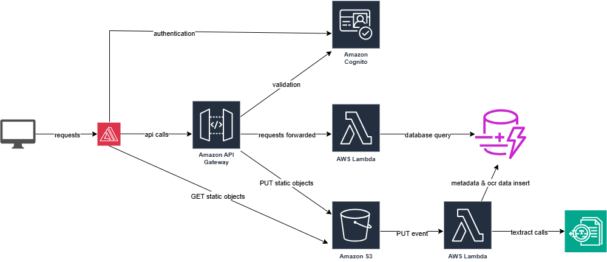

# ExpenseTracker Frontend 

An AI-powered expense tracking web application built as an AWS architecture practice project.

## Architecture



## Frontend

Built with **Next.js 15** and modern React patterns using:
- **UI Libraries**: Lucide React (icons), Framer Motion (animations)
- **Styling**: Tailwind CSS v4 with glass morphism design
- **Theme**: Light theme with gradient accents and responsive layout

## Setup

```bash
npm install
npm run dev
```

Open [http://localhost:3000](http://localhost:3000) to view the application.

## Features

- Responsive glass morphism design
- AI-powered expense recognition (AWS Textract integration)
- Smooth animations and micro-interactions
- Mobile-first responsive layout
